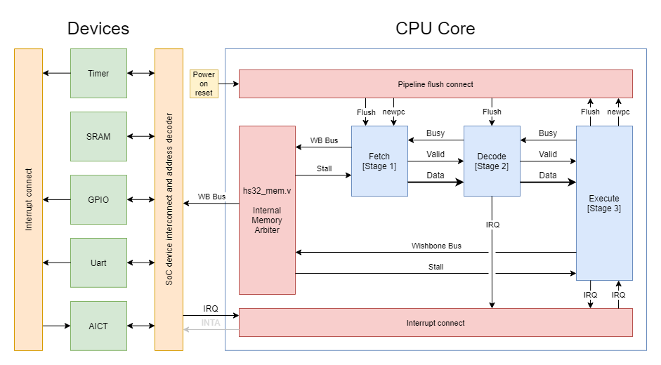

# HSC Latte HS32 Core

The HSC Latte HS32 Core is a 32-bits RISC CPU. The HS32 Core has 32-bits instructions and 16 32-bits registers.

Below is a list of HS32 Core Project Directories:

| Repository                                                        | Description             | License                                                                      | Issues                                                                     | Stars                                                                    | Contributors                                                                           |
| ----------------------------------------------------------------- | ----------------------- | ---------------------------------------------------------------------------- | -------------------------------------------------------------------------- | ------------------------------------------------------------------------ | -------------------------------------------------------------------------------------- |
| [caravel-hs32core](https://github.com/hsc-latte/caravel-hs32core) | Core Harness            |  |  |  |  |
| [hs32core-rtl](https://github.com/hsc-latte/hs32core-rtl)         | RTL Circuit Design      |      |      |      |      |
| [hs32core](https://github.com/hsc-latte/hs32core)                 | Main Project Repository |          |          |          |          |

## Table of Contents
- [HSC Latte HS32 Core](#hsc-latte-hs32-core)
  * [Table of Contents](#table-of-contents)
  * [Overview](#overview)
    + [Block Diagram Overview](#block-diagram-overview)
    + [Execution Unit Block Diagram](#execution-unit-block-diagram)
  * [Project Structure](#project-structure)
  * [General Documentation](#general-documentation)
    + [Instructions](#instructions)
    + [Encoding](#encoding)
    + [System Details](#system-details)
    + [Operation](#operation)
    + [CPU Planned Pinout](#cpu-planned-pinout)
    + [Devboard Block Diagram](#devboard-block-diagram)
    + [Timing Waveforms](#timing-waveforms)
      - [Read Cycle](#read-cycle)
      - [Write Cycle](#write-cycle)
  * [License](#license)

## Overview

HS32 is a RISC-type CPU. (...)

### Block Diagram Overview



### Execution Unit Block Diagram


## Project Structure

| Path | Description |
|-|-|
| `verilog/rtl/hs32cpu` | CPU Core Submodule |
| `verilog/rtl/hs32_user_proj` | User project files and wrapper |
| `verilog/rtl/hs32cpu/docs` | Detailed core documentation |
| `verilog/dv/hs32_nocaravel` | No-caravel testbenches |
| `verilog/dv/caravel/hs32_soc` | Caravel-integrated testbenches |

## General Documentation

### Instructions

- Immediate value is 16-bits
- Rd, Rn and Rm specify the way each register is wired to the ALU. In this case,
  Rd represents the read/write source/destination, Rm and Rn represents the 2 operands fed into the ALU; note that Rn will always have a barrel
  shifter in front of it.
- Naming a register with Rd Rn Rm is always 4 bits
- [xxx] = Dereference pointer, address is stored in xxx
- sh(Rn) shifts contents of Rn left or right by an 5-bits amount

### Encoding

These are the different encodings that instructions come in.
All instructions are 32 bit.
The first 8 bits is opcode.
Rd, Rm, Rn are always in the same position in the instruciton if present
<X> indicates unused spacer value of X bits

- Field Sizes:
  - Rd : 4 bit register name
  - Rm : 4 bit register name
  - Rn : 4 bit register name
  - Shift: 5 bit shift amount applied to Rn
  - Imm16: 16 bit literal field

<div class="ritz grid-container" dir="ltr"><table class="waffle" cellspacing="0" cellpadding="0"><thead><tr><th class="row-header freezebar-origin-ltr"></th>
  <th id="1092009867C0" style="width:121px" class="column-headers-background">A</th>
  <th id="1092009867C1" style="width:100px" class="column-headers-background">B</th>
  <th id="1092009867C2" style="width:100px" class="column-headers-background">C</th>
  <th id="1092009867C3" style="width:100px" class="column-headers-background">D</th>
  <th id="1092009867C4" style="width:100px" class="column-headers-background">E</th>
  <th id="1092009867C5" style="width:100px" class="column-headers-background">F</th>
  <th id="1092009867C6" style="width:100px" class="column-headers-background">G</th>
  <th id="1092009867C7" style="width:100px" class="column-headers-background">H</th>
  <th id="1092009867C8" style="width:100px" class="column-headers-background">I</th></tr></thead><tbody>

<tr style='height:20px;'>
  <th id="1092009867R0" style="height: 20px;" class="row-headers-background">
    <div class="row-header-wrapper" style="line-height: 20px;">1</div>
  </th>
  <td class="s0" dir="ltr">Name</td>
  <td class="s0" dir="ltr">[0:3]  </td>
  <td class="s0" dir="ltr">[4:7]  </td>
  <td class="s0" dir="ltr">[8:11] </td>
  <td class="s0" dir="ltr">[12:15]</td>
  <td class="s0" dir="ltr">[16:19]</td>
  <td class="s0" dir="ltr">[20:23]</td>
  <td class="s0" dir="ltr">[24:27]</td>
  <td class="s0" dir="ltr">[28:31]</td>
</tr>

<tr style='height:20px;'>
  <th id="1092009867R1" style="height: 20px;" class="row-headers-background">
    <div class="row-header-wrapper" style="line-height: 20px;">2</div>
  </th>
  <td class="s1" dir="ltr">I-Type<br/>(Immediate)</td>
  <td class="s0" dir="ltr" colspan="2">Opcode</td>
  <td class="s0" dir="ltr">Rd</td>
  <td class="s0" dir="ltr">Rm</td>
  <td class="s0" dir="ltr" colspan="4">Imm16</td>
</tr>

<tr style='height:20px;'>
  <th id="1092009867R3" style="height: 20px;" class="row-headers-background">
    <div class="row-header-wrapper" style="line-height: 20px;">5</div>
  </th>
  <td class="s0" dir="ltr">R-Type<br/>(Register)</td>
  <td class="s0" dir="ltr" colspan="2">Opcode</td>
  <td class="s0" dir="ltr" colspan="1">Rd</td>
  <td class="s0" dir="ltr" colspan="1">Rm</td>
  <td class="s0" dir="ltr" colspan="1">Rn</td>
  <td class="s0" dir="ltr" colspan="1">Shift</td>
  <td class="s0" dir="ltr" colspan="1">Shift | Shift Direction | Register Bank</td>
  <td class="s0" dir="ltr" colspan="1">Register Bank | XXX</td>
</tr>

<!--<tr style='height:20px;'>
  <th id="1092009867R3" style="height: 20px;" class="row-headers-background">
    <div class="row-header-wrapper" style="line-height: 20px;">6</div>
  </th>
  <td class="s0" dir="ltr">Jump Type (J-Type)</td>
  <td class="s0" dir="ltr" colspan="2">Opcode</td>
  <td class="s0" dir="ltr" colspan="1">Rd</td>
  <td class="s0" dir="ltr" colspan="1">Unused</td>
  <td class="s0" dir="ltr" colspan="4">16-bit Address or first half of 32-bit Address</td>
</tr>-->
</tbody></table></div>

### System Details

There are 16 (r0-r15) general-purpose registers plus 4 privileged registers.
In supervisor mode, r12-15 is separate from user-mode r12-15. In all modes, r14 and r15 will be used as the link register and stack pointer respectively.

Legend:

- **IRQs** -- Interrupt Requests
- **SP** -- Stack Pointer
- **LR** -- Link Register
- **MCR** -- Machine Configuration Register
- **IVT** -- Interrupt Vector Table

<table border=0 cellpadding=0 cellspacing=0 width=543>
 <tr height=19>
  <td rowspan=2 height=38 width=64>Register</td>
  <td colspan=3 width=287>Alias/Description</td>
 </tr>
 <tr height=19>
  <td height=19>User</td>
  <td>IRQ</td>
  <td>Supervisor</td>
 </tr>
 <tr height=19>
  <td height=19>r0-r11</td>
  <td colspan=3><center>Shared general purpose registers</center></td>
 </tr>
 <tr height=19>
  <td height=19>r12</td>
  <td>General</td>
  <td colspan=2><center>Interrupt Vector Table</center></td>
 </tr>
 <tr height=19>
  <td height=19>r13</td>
  <td>General</td>
  <td colspan=2><center>Machine Configuration Register</center></td>
 </tr>
 <tr height=19>
  <td height=19>r14</td>
  <td>User LR</td>
  <td>IRQ LR</td>
  <td>Super LR</td>
 </tr>
 <tr height=19>
  <td height=19>r15</td>
  <td>User SP</td>
  <td>IRQ SP</td>
  <td>Super SP</td>
 </tr>
</table>

### Operation

During a mode switch, the return address will be stored in the appropriate LR and the return stack pointer will be stored in the appropriate SP.

For instance, an interrupt call from User mode will prompt a switch to IRQ mode. The return address and stack pointer of the caller will be stored in IRQ LR (r14) and IRQ SP (r15) respectively.

### CPU Planned Pinout

WIP

### Devboard Block Diagram


### Timing Waveforms

Various timing diagrams of the address and data buses

#### Read Cycle

Clock Cycles: 4 minimum

Timing Requirements:
- The duration of the T<sub>W</sub> read clock (no data input) is determined by the `tpd` of whichever memory chip used.
- T<sub>W</sub> can span multiple clock periods to allow for different memory timings. This will allow the CPU to be clocked at a higher speed than the memory chips.

In the implementation, OE# is the AND of 2 signals, one leading edge and one falling edge-driven signals.

<!-- WAVEDROM JSON FILE
{ signal: [
  { name: "CLK",		wave: "hlhlhlhlhlh", node: "..1.2.3.4.5" },
  { name: "ALE0",		wave: "xh.l......x" },
  { name: "ALE1",		wave: "xl.h.l....." },
  { name: "WE#",		wave: "h.........." },
  { name: "OE#",		wave: "h.....l..h." },
  { name: "BHE#",		wave: "x.h.......x" },
  { name: "IO[15:0]",	wave: "x.9.9.x.5.x", data:[ "A[15:0]", "A[31:16]", "D[15:0]" ] },],
  head: { text: "Figure 1. Read Cycle Timing Waveform" },
  edge: [ '1<->2 T1', '2<->3 T2', '3<->4 TW', '4<->5 T3' ]
} -->


#### Write Cycle

Clock Cycles: 4 minimum

Timing Requirements:
- See the read cycle specifications

<!-- WAVEDROM JSON FILE
{ signal: [
  { name: "CLK",		wave: "hlhlhlhlhlh", node: "..1.2.3.4.5" },
  { name: "ALE0",		wave: "xh.l......x" },
  { name: "ALE1",		wave: "xl.h.l....." },
  { name: "WE#",		wave: "h.....l.h.." },
  { name: "OE#",		wave: "h.....l..h." },
  { name: "BHE#",		wave: "x.h.......x" },
  { name: "IO[15:0]",	wave: "x.9.9.7.x..", data:[ "A[15:0]", "A[31:16]", "D[15:0]" ] },],
  head: { text: "Figure 2. Write Cycle Timing Waveform" },
  edge: [ '1<->2 T1', '2<->3 T2', '3<->4 TW', '4<->5 T3' ]
} -->


## License

Apache 2.0 [LICENSE](https://github.com/hsc-latte/hs32core-rtl/tree/master/LICENSE)

HS32 Core - A 32-bits RISC Processor

```
  Copyright (c) 2020 The HSC Core Authors

  Licensed under the Apache License, Version 2.0 (the "License");
  you may not use this file except in compliance with the License.
  You may obtain a copy of the License at

      https://www.apache.org/licenses/LICENSE-2.0

  Unless required by applicable law or agreed to in writing, software
  distributed under the License is distributed on an "AS IS" BASIS,
  WITHOUT WARRANTIES OR CONDITIONS OF ANY KIND, either express or implied.
  See the License for the specific language governing permissions and
  limitations under the License.
```
